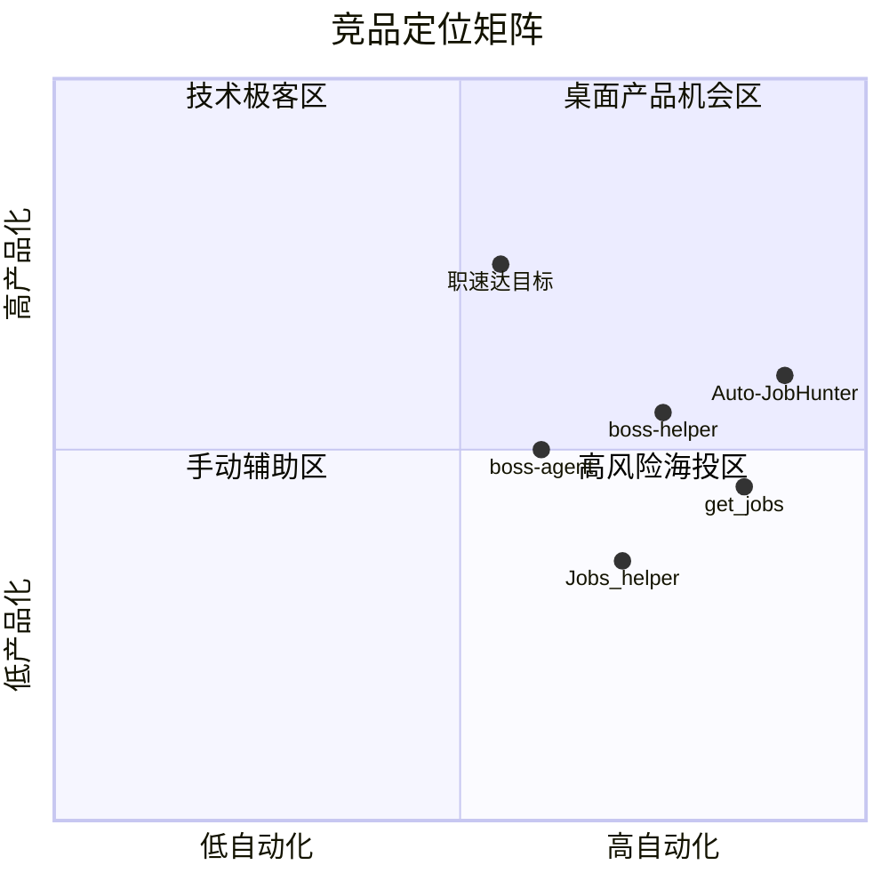

# 职速达竞品分析报告

> **版本**: v1.0 | **日期**: 2026-06-24 | **作者**: 产品部 Agent | **状态**: 草稿

---

## 一、分析范围

| 维度 | 说明 |
|------|------|
| 目标市场 | 中国互联网/IT 求职者，Boss 直聘为主平台 |
| 竞品类型 | 浏览器脚本、浏览器扩展、桌面 RPA、AI Agent |
| 分析目的 | 提炼差异化机会、规避已知风险、校准 MVP 范围 |

---

## 二、竞品全景图

---

## 三、核心竞品对比

### 3.1 功能对比矩阵

| 竞品 | 形态 | 平台 | 自动投递 | AI 回复 | 简历优化 | 数据看板 | 定价 | Stars |
|------|------|------|----------|---------|----------|----------|------|-------|
| [boss-helper](https://github.com/Ocyss/boss-helper) | Chrome 扩展 | Boss | ✅ 批量 | ✅ GPT 打招呼 | ⬜ | ⬜ | 免费开源 | ~1.5k |
| [Jobs_helper 海投助手](https://github.com/YangShengzhou03/Jobs_helper) | 油猴脚本 | Boss | ✅ 批量 | ✅ AI 回复 | ⬜ | ⬜ | 免费开源 | 较小 |
| [get_jobs](https://github.com/loks666/get_jobs) | Java 桌面 GUI | Boss/智联/猎聘/51 | ✅ 全自动 | ✅ AI 打招呼 | ⬜ | ✅ 企微通知 | 免费开源 | 高活跃 |
| [boss-agent](https://github.com/Douyh123/boss-agent) | Python + Playwright | Boss | ✅ MCP/Agent | ⬜ | ✅ 建议 | ⬜ | 免费开源 | 新兴 |
| [Auto-JobHunter](https://github.com/jolie-z/Auto-JobHunter) | FastAPI + RPA | Boss/51/猎聘 | ✅ 全自动 | ✅ LangGraph | ✅ 多 Agent | ✅ 飞书 | 免费开源 | 新项目 |
| **职速达（目标）** | Electron 桌面 | Boss→多平台 | ✅ L1 确认 | v0.2 | v0.3 | ✅ | Freemium | — |

### 3.2 技术栈对比

| 竞品 | 自动化方案 | 登录态 | 维护成本 |
|------|------------|--------|----------|
| boss-helper | 扩展注入 DOM | 浏览器 Cookie | 中（扩展商店审核） |
| Jobs_helper | 油猴脚本 | 浏览器 Cookie | 高（DOM 频繁变） |
| get_jobs | Selenium/Playwright | 本地 Cookie 文件 | 高 |
| boss-agent | Playwright | 本地 cookies 目录 | 中 |
| Auto-JobHunter | DrissionPage | Edge Cookie 导入 | 高 |
| **职速达** | Electron BrowserView + PlatformAdapter | 本地加密 SQLite | 中高 |

### 3.3 用户评价与痛点（来自 GitHub Issues / README）

| 共性痛点 | 竞品表现 | 职速达机会 |
|----------|----------|------------|
| 账号被封/限流 | 所有竞品均有反馈，高频海投风险极高 | L1 确认 + 小批量 + 长间隔 |
| 安装门槛高 | 脚本/扩展需技术背景 | 官网一键下载桌面安装包 |
| 无统一 UI | 多为命令行或浏览器内嵌 | 独立桌面应用 + 数据看板 |
| AI 成本 | 部分内置代理，部分需自备 Key | 用户自带 Key（v0.2），MVP 无 AI |
| 多平台割裂 | get_jobs / Auto-JobHunter 覆盖广但复杂 | MVP 聚焦 Boss 做深 |
| 信任问题 | 开源脚本用户担心数据安全 | 本地存储 + 官网安全承诺 |

---

## 四、差异化机会

### 4.1 职速达核心差异

1. **产品化体验**：对标 [OpenClaw 桌面版](https://openclawcn.net/) 官网分发 + 图形化配置，降低非技术用户门槛
2. **半自动优先**：L1「确认即投」而非无脑海投，降低封号概率，合规叙事更清晰
3. **本地数据主权**：简历、Cookie、投递记录全本地，不上传云端（MVP）
4. **平台适配层**：`PlatformAdapter` 隔离 DOM 变更，比油猴脚本更易维护
5. **求职数据看板**：竞品多为投递工具，少有一站式进度可视化

### 4.2 不建议对标的方向

- **每日 150+ 自动海投**：竞品 get_jobs 以此为核心卖点，封号风险极高，不宜作为职速达主叙事
- **扩展商店分发**：审核风险 + 与 Boss 对抗，桌面端更可控
- **MVP 即多平台**：Auto-JobHunter 架构重，一人团队应 Boss 单点突破

---

## 五、定价对比

| 产品 | 模式 | 价格 | 备注 |
|------|------|------|------|
| boss-helper | 免费开源 | ¥0 | 无商业化 |
| get_jobs | 免费开源 | ¥0 | 作者接受打赏 |
| 脉脉/猎聘会员 | 平台会员 | ¥68-198/月 | 非自动化工具 |
| BOSS 直聘 VIP | 平台增值 | ¥68/月起 | 曝光加成，非批量投递 |
| **职速达 Pro** | 订阅 | ¥39/月（v0.2） | 无限投递 + HR 回复 |

**结论**：求职工具赛道开源免费竞品多，付费需靠 **体验溢价 + AI 能力 + 数据看板** 而非单纯「能自动投」。

---

## 六、风险借鉴

| 风险 | 竞品教训 | 职速达应对 |
|------|----------|------------|
| Boss 封号 | get_jobs 明确提示每日上限 150 次；用户反馈频繁封禁 | MVP ≤10 次/批，间隔 15-30 秒 |
| DOM 变更 | boss-helper 26 个 open issues，维护压力大 | PlatformAdapter + 快速热修复 SOP |
| 法律风险 | 均为「个人学习」免责声明 | 正式用户协议 + 辅助工具定位 |
| 安装复杂 | Python/Java 环境配置劝退用户 | Electron 一键安装 |

---

## 七、战略建议

1. **MVP 定位**：「智能筛选 + 确认即投的 Boss 求职助手」，而非「全自动海投神器」
2. **目标用户**：能接受桌面应用的 IT 从业者（与 PRD 画像一致），避开纯小白脚本用户群
3. **竞争壁垒**：产品体验 + 本地数据信任 + 持续 Boss 适配，而非功能数量
4. **Go-to-Market**：技术社区（V2EX、知乎、小红书求职帖）+ 官网 SEO，对标 OpenClaw 官网叙事

---

## 八、参考资料

- [boss-helper](https://github.com/Ocyss/boss-helper) — 1.5k Stars，功能最全的 Boss 扩展
- [Jobs_helper 海投助手](https://github.com/YangShengzhou03/Jobs_helper) — 油猴脚本方案
- [get_jobs](https://github.com/loks666/get_jobs) — 多平台 Java 桌面方案
- [boss-agent](https://github.com/Douyh123/boss-agent) — Playwright + MCP Agent
- [Auto-JobHunter](https://github.com/jolie-z/Auto-JobHunter) — 工业级多平台 RPA
- [OpenClaw 桌面版官网](https://openclawcn.net/) — 官网与分发参考
