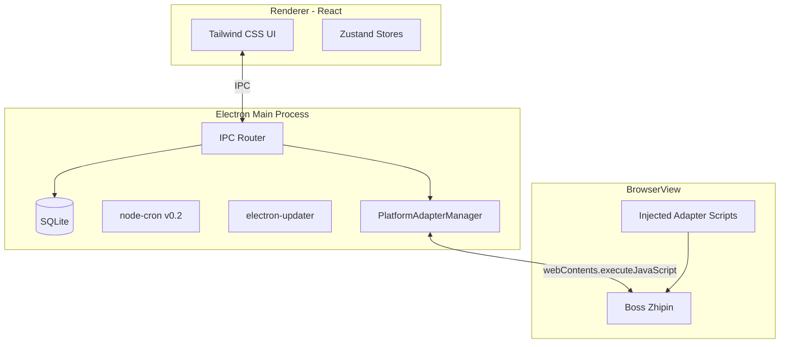

# 职速达技术方案

> **版本**: v1.1 | **日期**: 2026-06-24 | **作者**: 技术部 Agent | **关联 PRD**: [prd.md](./prd.md)  
> **UI 栈说明**：渲染层已改为 **Tailwind CSS**（不再使用 Ant Design）。Agent 开发规范与路线图以 [`docs/AGENTS.md`](./AGENTS.md)、[`docs/TODO.md`](./TODO.md) 为准。

---

## 一、架构总览

职速达为 **独立 Electron 桌面应用**，采用主进程 + 渲染进程 + BrowserView 三层架构。



---

## 二、仓库结构

独立代码库：`zhisuda-desktop/`（与 `opc-workflow` 文档仓库分离）

```
zhisuda-desktop/
├── package.json
├── electron-builder.yml
├── electron.vite.config.ts
├── tailwind.config.js
├── tsconfig.json
├── src/
│   ├── main/                    # 主进程
│   │   ├── index.ts             # 应用入口
│   │   ├── ipc/                 # IPC handlers
│   │   ├── db/                  # SQLite 初始化与 migrations
│   │   ├── services/
│   │   │   ├── user.service.ts
│   │   │   ├── resume.service.ts
│   │   │   ├── delivery.service.ts
│   │   │   └── updater.service.ts
│   │   └── platform/            # 平台适配层
│   │       ├── types.ts         # PlatformAdapter 接口
│   │       ├── adapter-manager.ts
│   │       └── boss/
│   │           ├── boss-adapter.ts
│   │           └── scripts/     # 注入脚本（纯 JS 字符串）
│   ├── preload/
│   │   └── index.ts             # contextBridge API
│   └── renderer/                # React 前端
│       ├── App.tsx
│       ├── pages/
│       │   ├── Home.tsx
│       │   ├── Resume.tsx
│       │   ├── Preferences.tsx
│       │   ├── Jobs.tsx
│       │   ├── Dashboard.tsx
│       │   └── Settings.tsx
│       ├── components/
│       ├── stores/
│       └── styles/              # 仅 Tailwind 入口（index.css）
├── resources/                   # 图标、模板
├── spike/                       # 技术验证代码（可合并至 main）
└── docs/                        # 产品与技术文档
    ├── AGENTS.md
    ├── TODO.md
    ├── prd.md
    └── tech-spec.md
```

官网独立仓库：`zhisuda-website/`  
完整目录树见 [`docs/TODO.md`](./TODO.md)。

---

## 三、技术栈

| 层级 | 选型 | 版本 | 说明 |
|------|------|------|------|
| 运行时 | Electron | 28+ | 桌面壳 + BrowserView |
| 语言 | TypeScript | 5.x | 全栈 TS |
| 前端 | React | 18 | UI 框架（函数式组件） |
| 样式 | Tailwind CSS | 3.x | 唯一样式方案；~~Ant Design~~ 已废弃 |
| 状态 | Zustand | 4.x | 轻量状态管理 |
| 数据库 | better-sqlite3 | 11.x | 同步 SQLite，主进程访问 |
| 构建 | electron-vite | 2.x | 主/渲染进程打包 |
| 分发 | electron-builder | 24.x | Win/Mac 安装包 |
| 更新 | electron-updater | 6.x | 对接官网 latest.yml |
| 简历解析 | pdf-parse + mammoth | — | PDF/Word |
| AI（v0.2） | OpenAI SDK | 4.x | 兼容多提供商 |

**明确不使用**：Puppeteer 控制 BrowserView（架构不匹配，见 [spike-report.md](./spike-report.md)）

---

## 四、PlatformAdapter 设计

### 4.1 接口定义

```typescript
// src/main/platform/types.ts
export interface JobListing {
  id: string;
  title: string;
  company: string;
  salary: string;
  city: string;
  url: string;
  description?: string;
  isOutsource?: boolean;
}

export interface PlatformAdapter {
  readonly platformId: 'boss' | '51job';
  readonly displayName: string;

  /** 加载登录页到 BrowserView */
  loadLoginPage(view: BrowserView): void;

  /** 检测是否已登录 */
  checkLoginStatus(view: BrowserView): Promise<boolean>;

  /** 抓取当前推荐/搜索页岗位列表 */
  fetchJobListings(view: BrowserView): Promise<JobListing[]>;

  /** 对单个岗位发起沟通/投递 */
  applyToJob(view: BrowserView, jobId: string, greeting?: string): Promise<ApplyResult>;

  /** 检测未读 HR 消息数量（MVP 仅计数） */
  getUnreadMessageCount(view: BrowserView): Promise<number>;
}

export interface ApplyResult {
  success: boolean;
  errorCode?: 'RATE_LIMIT' | 'CAPTCHA' | 'DOM_CHANGED' | 'NETWORK' | 'UNKNOWN';
  message?: string;
}
```

### 4.2 脚本注入方式

```typescript
// BossAdapter 内部
async fetchJobListings(view: BrowserView): Promise<JobListing[]> {
  const script = readFileSync(join(__dirname, 'scripts/fetch-jobs.js'), 'utf-8');
  const result = await view.webContents.executeJavaScript(script);
  return result as JobListing[];
}
```

注入脚本要求：
- 纯 IIFE，不依赖 Node 模块
- 返回可序列化 JSON
- DOM 选择器集中在 `scripts/` 目录，便于热更新

### 4.3 人工接管

当 `ApplyResult.errorCode` 为 `CAPTCHA` | `DOM_CHANGED` | `RATE_LIMIT` 时：
1. 主进程暂停批量投递队列
2. 渲染进程高亮 WebView 区域
3. 提示用户手动完成当前操作后点击「继续」

---

## 五、IPC 通信

| Channel | 方向 | 用途 |
|---------|------|------|
| `user:getProfile` | R→M | 获取本地用户信息 |
| `user:updateNickname` | R→M | 更新昵称 |
| `resume:upload` | R→M | 上传并解析简历 |
| `preferences:save` | R→M | 保存求职偏好 |
| `platform:login` | R→M | 打开 Boss WebView 登录 |
| `platform:fetchJobs` | R→M | 触发岗位抓取 |
| `delivery:applyBatch` | R→M | L1 批量投递 |
| `delivery:getRecords` | R→M | 投递记录查询 |
| `messages:checkUnread` | R→M | HR 消息轮询 |
| `updater:check` | R→M | 检查更新 |

---

## 六、数据层

- 数据库文件：`{userData}/zhisuda.db`
- 迁移工具：自研 SQL migration 文件 `src/main/db/migrations/`
- 敏感字段加密：`cookies_encrypted`、`api_key_encrypted` 使用 AES-256-GCM，密钥派生自 OS keychain（`keytar`）

详见 PRD 第六节数据模型；MVP `users` 表仅 `id`、`device_id`、`nickname`。

---

## 七、electron-updater 配置

### 7.1 electron-builder.yml 片段

```yaml
publish:
  provider: generic
  url: https://download.zhishuda.com/releases/
```

### 7.2 发布产物

```
releases/
├── latest.yml          # Windows
├── latest-mac.yml      # macOS
├── 职速达-Setup-0.1.0.exe
├── 职速达-0.1.0-mac.dmg
└── SHA256SUMS.txt
```

### 7.3 更新流程

1. 应用启动 5 秒后静默检查 `latest.yml`
2. 有新版本 → 通知栏提示「发现新版本」
3. 用户确认 → 后台下载 → 提示重启安装
4. 支持「跳过此版本」

---

## 八、安全

| 措施 | 实现 |
|------|------|
| Context Isolation | `contextIsolation: true`, `nodeIntegration: false` |
| Preload 白名单 | 仅暴露 `window.zhishuda.*` API |
| Cookie 存储 | AES 加密写入 SQLite |
| CSP | 渲染进程严格 CSP |
| 崩溃上报 | Sentry opt-in，默认关闭 |

---

## 九、构建与 CI

```yaml
# .github/workflows/release.yml（规划）
on:
  push:
    tags: ['v*']
jobs:
  build:
    strategy:
      matrix:
        os: [windows-latest, macos-latest]
    steps:
      - uses: actions/checkout@v4
      - run: npm ci && npm run build
      - run: npm run dist
      - uses: softprops/action-gh-release@v2
```

安装包同步上传至 CDN，更新 `latest.yml`。

---

## 十、测试策略

| 类型 | 范围 | 工具 |
|------|------|------|
| 单元测试 | 匹配算法、薪资解析 | Vitest |
| 集成测试 | SQLite CRUD | Vitest + 内存 DB |
| 平台适配 | Boss 脚本 | 人工回归清单 + mock HTML fixture |
| E2E | 主流程 | 手动（Boss 环境不可 CI 化） |

### Boss 人工回归清单

- [ ] WebView 加载登录页
- [ ] 扫码/密码登录成功
- [ ] Cookie 持久化，重启后仍登录
- [ ] 抓取岗位列表 ≥5 条
- [ ] 单次投递成功
- [ ] 连续 3 次失败触发人工接管提示

---

## 十一、平台维护 SOP

1. **监控**：用户反馈 + 投递失败率异常告警（`DOM_CHANGED` 错误码激增）
2. **定位**：对比 Boss 页面 DOM 与 `scripts/` 选择器
3. **修复**：仅更新 `boss/scripts/`，发 hotfix 版本
4. **验证**：人工回归清单全部通过
5. **发布**：patch 版本 + 更新日志

目标响应时间：DOM 变更后 **48 小时内** 发布适配版本。

---

## 十二、相关文档

- [AGENTS.md](./AGENTS.md) — Agent 开发规范
- [TODO.md](./TODO.md) — 分阶段路线图
- [PRD v1.1](./prd.md)
- [Boss Spike 报告](./spike-report.md)
- [竞品分析](./competitor-analysis.md)
- [UI 交互原型](./ai-job-delivery/index.html)
